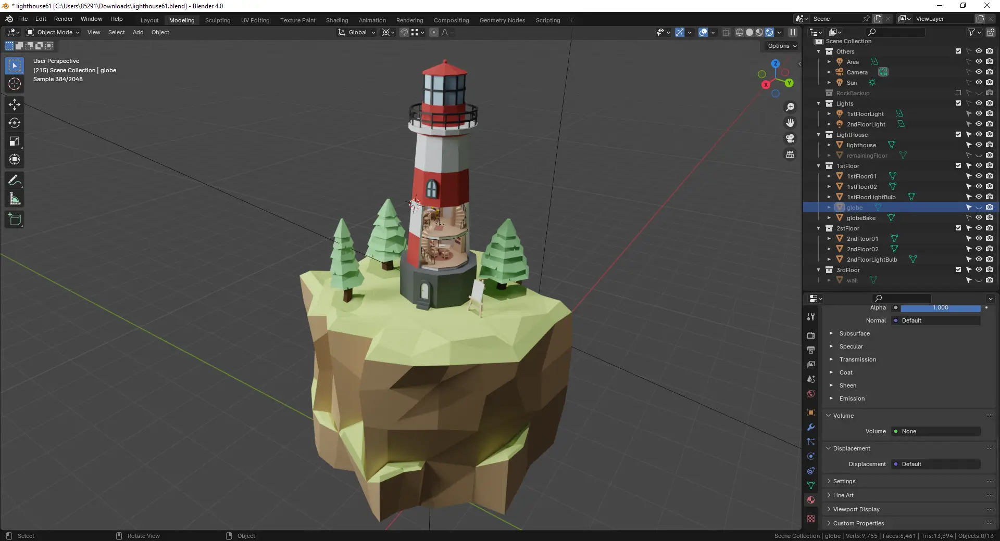
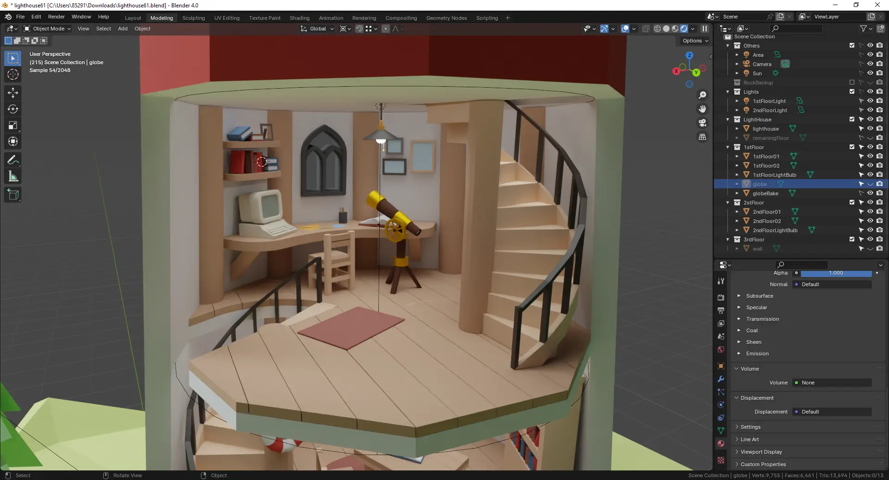

<div>
  <div align="center">
    
  </div>
  <h1 align="center">David's Lighthouse</h1>
  <p>The <a href="https://davidlighthouse.com/"><ins>davidlighthouse.com</ins></a> is my portfolio website hosted on Netlify. It's fully responsive and accessible. You can toggle the <strong>light mode</strong> and <strong>dark mode</strong> with the slider. </p>
  
</div>

## :movie_camera:	Blender Model
<div align="center">
  
  <br />
  <br />
  
  <br />
  <br />
  
</div>

## :hammer_and_wrench: Installation & Set Up
1. Install correct node version
   
   ```sh
   node --version
   v18.18.2
   ```
   
2. Install dependencies
   
   ```sh
   npm install
   ```
   
3. Start the local server
   
   ```sh
   npm run dev
   ```

## :computer: Tools Used
Blender, React.js, Typescript, Three.js, React Three Fiber, React Spring, Tailwind, GLSL, Svgator, Lottie, Netlify
